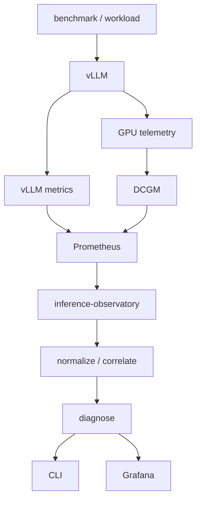

# inference-observatory

Observability and performance diagnosis for LLM inference — correlate
inference-server metrics, NVIDIA GPU telemetry, and profiling data to
explain performance bottlenecks.

**Status:** pre-alpha / active development. The repository includes a
single-GPU telemetry collection stack (vLLM + DCGM Exporter + Prometheus)
with static validation passed. Live NVIDIA GPU validation is pending.
It does not yet diagnose, normalize, or visualize metrics. See
[Scope](docs/scope.md) for what is implemented versus planned.

## Problem statement

Collecting metrics is not the same as diagnosing inference behaviour.
A dashboard may show that time-to-first-token (TTFT) rose, but it does
not explain *why*. To answer that, the observatory must correlate, over
a common observation window, signals that today live in separate tools:

- request behaviour (arrival rate, concurrency, batch size)
- queue behaviour (waiting / running requests)
- KV-cache state (usage, pressure, evictions)
- GPU utilization (SM activity)
- GPU memory (allocated, reserved, free)
- power and clocks (throttling, thermal)
- profiling traces (kernel / operator breakdown)
- benchmark / run metadata (which workload produced these numbers)

The goal is to turn that evidence into a deterministic, reproducible
explanation of inference bottlenecks rather than a wall of charts.

## Project goals

- GPU-aware LLM inference observability (NVIDIA first).
- A normalized inference metric model so diagnosis and reporting do
  not depend on backend-specific metric names.
- Metric correlation across a common observation interval and run id.
- Deterministic, evidence-based diagnosis rules.
- Experiment / run comparison (baseline vs current).
- Profiling integration (PyTorch Profiler traces).
- Single-GPU first, then two-GPU analysis.

## Non-goals

- A custom time-series database.
- A Grafana replacement.
- A custom NVIDIA exporter.
- LLM-based root-cause analysis in V1.
- Autonomous remediation / auto-tuning.
- Fleet-scale Kubernetes monitoring in V1.
- Generic application monitoring.

## Planned architecture



**Implemented now:**

- Go CLI `observatory version`
- Single-GPU Docker telemetry stack (vLLM + DCGM Exporter + Prometheus) — configured, live GPU validation pending
- vLLM metrics collection via Prometheus scrape — configured
- DCGM GPU telemetry collection via Prometheus scrape — configured
- Telemetry preflight and validation scripts — static validation passed

**Planned for V1:** canonical metric adapters, dashboards, diagnosis,
experiment comparison, profiling, two-GPU analysis. See
[docs/architecture.md](docs/architecture.md) for the layer model and
[docs/scope.md](docs/scope.md) for the V1 boundaries.

## Initial support matrix

| Area                  | V1 target           | Status                              |
|-----------------------|---------------------|-------------------------------------|
| GPU vendor            | NVIDIA              | configured; live validation pending |
| GPU count             | 1–2                 | single-GPU config; pending          |
| Inference backend     | vLLM                | configured                          |
| Metrics               | Prometheus          | configured; static validation passed|
| GPU telemetry         | DCGM Exporter       | configured; live validation pending |
| Visualization         | Grafana             | planned                             |
| Deep profiling        | PyTorch Profiler    | planned                             |
| Diagnosis             | deterministic rules | planned                             |
| Deployment            | Docker              | configured                           |

## Quick start

### CLI

```bash
make build
./bin/observatory version
make test
```

`make build` injects version metadata from git via linker flags, so the
output reflects the current revision and build time, for example:

```text
$ make build
$ ./bin/observatory version
inference-observatory v0.1.0-3-gf32b2c3
commit: f32b2c3
built: 2026-08-30T10:23:47Z
```

A direct `go build ./cmd/observatory` (without the Makefile `-ldflags`
injection) falls back to default metadata:

```text
$ go build ./cmd/observatory
$ ./observatory version
inference-observatory dev
commit: unknown
built: unknown
```

```bash
./bin/observatory --help      # usage
./bin/observatory frobnicate  # unknown command -> exit code 2
```

### Telemetry stack (requires a Linux NVIDIA GPU host)

```bash
cp deploy/.env.example deploy/.env   # optional: customize
./scripts/preflight-gpu.sh           # verify host readiness
make telemetry-up                    # start vLLM + DCGM + Prometheus
make telemetry-validate              # validate scraping + metrics
```

See [docs/telemetry-stack.md](docs/telemetry-stack.md) for full
instructions, remote access via SSH forwarding, and troubleshooting.

## Roadmap

See [docs/roadmap.md](docs/roadmap.md). v0.1 (Foundation) is complete.
This repository implements the **v0.2 — Telemetry stack** stage.

## Development

```bash
make build              # build bin/observatory with version metadata
make test               # go test ./...
make fmt                # gofmt -w .
make fmt-check          # fail if gofmt would change anything
make vet                # go vet ./...
make check              # fmt-check + vet + test
make clean              # remove build artefacts
make telemetry-config   # render compose config (no GPU needed)
make telemetry-preflight # check host GPU readiness
make telemetry-up       # start telemetry stack (needs Linux NVIDIA GPU)
make telemetry-down     # stop telemetry stack
make telemetry-logs     # tail telemetry stack logs
make telemetry-validate # validate scraping + metrics
```

Contributions are welcome — see [CONTRIBUTING.md](CONTRIBUTING.md).

## License

Apache-2.0. See [LICENSE](LICENSE).