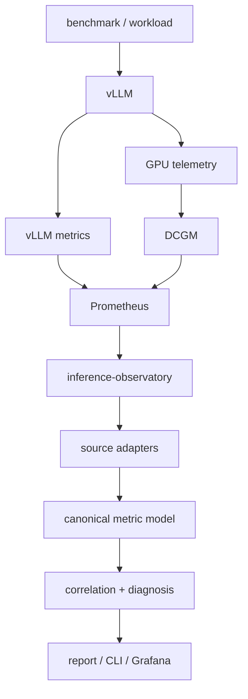

# Architecture

This document defines the long-term logical layers of
`inference-observatory`. It describes the intended design. The
foundation layer is implemented and the v0.2 telemetry collection
stack is configured (live GPU validation pending). Nothing beyond the
layers explicitly listed under "What exists now" is implemented.

## Overview

The observatory sits downstream of the inference server and its
telemetry sources. It normalizes backend-specific signals into a
canonical model, correlates them across a common observation window,
and runs deterministic diagnosis rules to explain bottlenecks.



## Layers

### Source adapters

Backend-specific integrations live behind adapters and never leak their
native metric names outside the adapter boundary. Planned adapters:

- vLLM (Prometheus-scraped inference metrics)
- DCGM Exporter (NVIDIA GPU telemetry)
- benchmark metadata (run/workload descriptors)
- profiling traces (PyTorch Profiler)

An adapter's responsibility is: discover metrics, validate them, and
translate them into the canonical model. It must not diagnose.

### Canonical metric model

The canonical model is an internal, backend-agnostic representation so
that correlation, diagnosis, and reporting depend on stable concepts
(`ttft`, `tpot`, `gpu_utilization`, `kv_cache_usage`, ...) rather than
on `vllm:time_to_first_token_seconds` or `DCGM_FI_DEV_GPU_UTIL`.

The model is **not implemented** in this PR. It is documented here to
set the boundary that future adapters must respect.

### Correlation

Correlation aligns signals from different sources onto a common
observation interval and, eventually, a common experiment/run
identifier. The output is a correlated view suitable for diagnosis,
not a new time-series store.

### Diagnosis

Diagnosis produces structured findings of the form:

```text
symptom
evidence
interpretation
suggested experiment
confidence
```

Example (future, not implemented):

```text
Symptom:
TTFT p95 elevated

Evidence:
- waiting requests increasing
- GPU utilization > 95%
- TPOT remains healthy
- KV cache below pressure threshold

Interpretation:
GPU saturation / scheduler queueing

Suggested experiment:
Reduce concurrency and re-measure TTFT.

Confidence:
high
```

Diagnosis is deterministic and evidence-cited. V1 does not use an LLM
for diagnosis.

### Profiling

PyTorch Profiler traces provide kernel/operator-level detail that
metrics cannot. The observatory will summarize and diff traces and
correlate them with a run. Trace parsing is **not implemented**.

### Presentation

Planned presentation surfaces:

- CLI (`observatory diagnose`, `observatory compare`, ...)
- JSON reports
- Grafana dashboards

Only the `version` CLI command exists today.

## What exists now

- `cmd/observatory` — CLI with `version` and help only.
- `internal/buildinfo` — build-time version metadata.
- `deploy/compose.yaml` — single-GPU Docker telemetry stack (vLLM +
  DCGM Exporter + Prometheus). Configured; live GPU validation pending.
- `prometheus/prometheus.yml` — scrape configuration for vLLM and DCGM.
- `scripts/preflight-gpu.sh` — host readiness checks.
- `scripts/validate-telemetry.sh` — Prometheus-based scrape validation.
- Documentation, CI, contribution templates.

## What is planned

Everything in the layer model above. See `docs/scope.md` and
`docs/roadmap.md`.