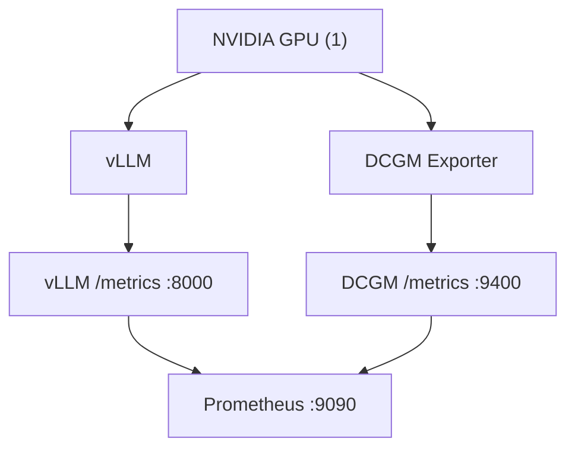

# Telemetry stack (v0.2)

This document describes the single-GPU telemetry collection stack
introduced in v0.2. The stack collects raw upstream metrics from vLLM
and NVIDIA DCGM Exporter into Prometheus. It does **not** interpret,
normalize, diagnose, or visualize them — those are later milestones.

## Architecture



Three services run in a Docker Compose network:

| Service         | Image (pinned)                                          | Port  | Role                          |
|-----------------|---------------------------------------------------------|-------|-------------------------------|
| vLLM            | `vllm/vllm-openai:v0.26.0`                              | 8000  | Inference server + `/metrics` |
| DCGM Exporter   | `nvcr.io/nvidia/k8s/dcgm-exporter:4.6.0-4.8.3-distroless` | 9400 | GPU telemetry `/metrics`      |
| Prometheus      | `prom/prometheus:v3.14.0`                               | 9090  | Scrape + TSDB storage         |

Prometheus scrapes both targets every 5 seconds using Compose DNS
names (`vllm:8000`, `dcgm-exporter:9400`), not exposed host ports.

## Requirements

The live telemetry stack requires:

- **Linux** host (not macOS)
- **NVIDIA GPU** (at least one)
- **NVIDIA driver** installed
- **Docker Engine**
- **Docker Compose v2**
- **NVIDIA Container Toolkit** (so Docker can access the GPU)
- **python3** (for Prometheus JSON parsing in validate-telemetry.sh)

macOS developers can run static checks (`make check`, `make telemetry-config`,
`bash -n scripts/*.sh`) but cannot run the live stack.

## Start

```bash
# 1. Create local env from the example (optional — Makefile falls back
#    to deploy/.env.example if deploy/.env does not exist).
cp deploy/.env.example deploy/.env

# 2. Verify the host is ready (read-only, non-mutating).
./scripts/preflight-gpu.sh

# 3. Start the stack.
make telemetry-up

# 4. Validate that Prometheus is scraping both targets and metrics are
#    present. This also sends one tiny inference request.
make telemetry-validate
```

The first start downloads the model (`Qwen/Qwen3-0.6B` by default),
which may take several minutes depending on network bandwidth. The
validation script uses bounded retries (default 600s timeout) rather
than a fixed sleep.

## Inspect

| What                    | URL / command                                  |
|-------------------------|------------------------------------------------|
| vLLM API                | `http://127.0.0.1:8000/v1/models`             |
| vLLM raw metrics        | `http://127.0.0.1:8000/metrics`               |
| DCGM raw metrics        | `http://127.0.0.1:9400/metrics`               |
| Prometheus UI           | `http://127.0.0.1:9090`                       |
| Prometheus targets      | `http://127.0.0.1:9090/api/v1/targets`        |
| Prometheus readiness    | `http://127.0.0.1:9090/-/ready`               |

Live logs:

```bash
make telemetry-logs
```

## Stop

```bash
make telemetry-down
```

This removes containers but keeps the `prometheus-data` named volume.
To remove the volume as well:

```bash
docker compose -f deploy/compose.yaml --env-file deploy/.env down -v
```

## Remote machine access

All host ports are bound to `127.0.0.1` by default so the stack is not
exposed publicly. To access a remote GPU machine safely, use SSH port
forwarding from your local workstation:

```bash
ssh -L 8000:127.0.0.1:8000 \
    -L 9090:127.0.0.1:9090 \
    -L 9400:127.0.0.1:9400 \
    user@gpu-host
```

Then open `http://127.0.0.1:9090` locally. Replace `user@gpu-host` with
your actual SSH destination. Do not change the Compose bind address to
`0.0.0.0` unless you have a firewall and understand the exposure risk.

## Configuration

All configurable values live in `deploy/.env.example`. Copy it to
`deploy/.env` to customize:

| Variable                       | Default                                           | Purpose                              |
|--------------------------------|---------------------------------------------------|--------------------------------------|
| `VLLM_IMAGE`                   | `vllm/vllm-openai:v0.26.0`                        | Pinned vLLM image                    |
| `VLLM_MODEL`                   | `Qwen/Qwen3-0.6B`                                 | Model to serve (public, non-gated)   |
| `VLLM_PORT`                    | `8000`                                            | Host port for vLLM                   |
| `VLLM_GPU_MEMORY_UTILIZATION`  | `0.80`                                            | GPU memory fraction for vLLM         |
| `VLLM_MAX_MODEL_LEN`           | `4096`                                            | Maximum sequence length              |
| `DCGM_EXPORTER_IMAGE`          | `nvcr.io/nvidia/k8s/dcgm-exporter:4.6.0-4.8.3-distroless` | Pinned DCGM Exporter image |
| `DCGM_EXPORTER_PORT`           | `9400`                                            | Host port for DCGM Exporter          |
| `PROMETHEUS_IMAGE`             | `prom/prometheus:v3.14.0`                         | Pinned Prometheus image              |
| `PROMETHEUS_PORT`              | `9090`                                            | Host port for Prometheus             |
| `PROMETHEUS_RETENTION`         | `24h`                                             | TSDB retention for the demo          |
| `GPU_DEVICE_ID`                | `0`                                               | Which GPU vLLM uses (single-GPU demo) |

Do not commit `deploy/.env`. The default demo does not require a
Hugging Face token.

## Telemetry inventory

These are raw upstream metric names. They are **not** renamed into
Observatory canonical names — that is v0.3.

### vLLM metrics (v0.26.0)

Verified against the vLLM v0.26.0 metrics documentation
(https://docs.vllm.ai/en/v0.26.0/design/metrics.html):

| Metric                                  | Type      | What it measures                |
|-----------------------------------------|-----------|---------------------------------|
| `vllm:num_requests_running`             | Gauge     | Requests currently generating   |
| `vllm:num_requests_waiting`             | Gauge     | Requests waiting in queue       |
| `vllm:kv_cache_usage_perc`              | Gauge     | KV-cache usage fraction         |
| `vllm:time_to_first_token_seconds`      | Histogram | TTFT distribution               |
| `vllm:request_queue_time_seconds`       | Histogram | Queue wait time                 |
| `vllm:request_prefill_time_seconds`     | Histogram | Prefill phase duration          |
| `vllm:request_decode_time_seconds`      | Histogram | Decode phase duration           |
| `vllm:prompt_tokens_total`              | Counter   | Total prompt tokens processed   |
| `vllm:generation_tokens_total`          | Counter   | Total tokens generated          |

### DCGM Exporter metrics (4.6.0-4.8.3)

Verified against the DCGM Exporter `default-counters.csv`
(https://github.com/NVIDIA/dcgm-exporter/blob/main/etc/default-counters.csv):

| Metric                         | Type  | What it measures                |
|--------------------------------|-------|---------------------------------|
| `DCGM_FI_DEV_GPU_UTIL`         | Gauge | GPU SM utilization (%)          |
| `DCGM_FI_DEV_FB_USED`          | Gauge | Framebuffer memory used (MB)    |
| `DCGM_FI_DEV_FB_FREE`          | Gauge | Framebuffer memory free (MB)    |
| `DCGM_FI_DEV_SM_CLOCK`         | Gauge | SM clock (MHz)                  |
| `DCGM_FI_DEV_MEM_CLOCK`        | Gauge | Memory clock (MHz)              |
| `DCGM_FI_DEV_GPU_TEMP`         | Gauge | GPU temperature (C)             |
| `DCGM_FI_DEV_POWER_USAGE`      | Gauge | Power draw (W)                  |
| `DCGM_FI_PROF_PCIE_RX_BYTES`   | Gauge | PCIe receive throughput (B/s)   |
| `DCGM_FI_PROF_PCIE_TX_BYTES`   | Gauge | PCIe transmit throughput (B/s)  |

> **Note:** `DCGM_FI_PROF_*` fields are profiling metrics. Their
> availability depends on GPU class/capability — they require
> datacenter GPUs (Volta or newer) and may not appear on consumer GPUs.
> The telemetry validator relies on stable basic `DCGM_FI_DEV_*`
> metrics only, not `DCGM_FI_PROF_*` metrics.

## Troubleshooting

### Docker cannot see GPU

```
docker: Error response from daemon: could not select device driver ...
```

Install the NVIDIA Container Toolkit and configure the Docker runtime:

```bash
sudo nvidia-ctk runtime configure --runtime=docker
sudo systemctl restart docker
```

Verify: `docker run --rm --gpus all nvidia/cuda:12.6.0-base-ubuntu22.04 nvidia-smi`

### DCGM Exporter fails to start

Ensure the NVIDIA driver is loaded and `nvidia-smi` works on the host.
The distroless image uses `cap_add: SYS_ADMIN` and GPU device access —
it should not need `privileged: true`. If DCGM still fails, check
driver version compatibility with DCGM 4.6.0.

### vLLM model download failure

The first start downloads the model from Hugging Face. If the download
fails, check network connectivity and disk space. The default model
`Qwen/Qwen3-0.6B` is public and does not require an HF token. If you
configure a gated model, set `HF_TOKEN` in `deploy/.env` (never commit
it).

### vLLM OOM

Reduce `VLLM_GPU_MEMORY_UTILIZATION` (e.g. to `0.50`) or
`VLLM_MAX_MODEL_LEN` (e.g. to `2048`) in `deploy/.env`. The demo model
is small; OOM usually means the GPU is shared with another workload.

### Prometheus target DOWN

Check `http://127.0.0.1:9090/api/v1/targets` for the `lastError` field.
Common causes: vLLM still starting up (wait longer), DCGM Exporter
crashed (`make telemetry-logs`), or a Compose network issue
(`make telemetry-down && make telemetry-up`).

### Port already in use

All host ports bind to `127.0.0.1`. If a port is already in use, either
stop the conflicting process or change the port in `deploy/.env` (e.g.
`VLLM_PORT=8001`). Remember to update SSH forwarding accordingly.